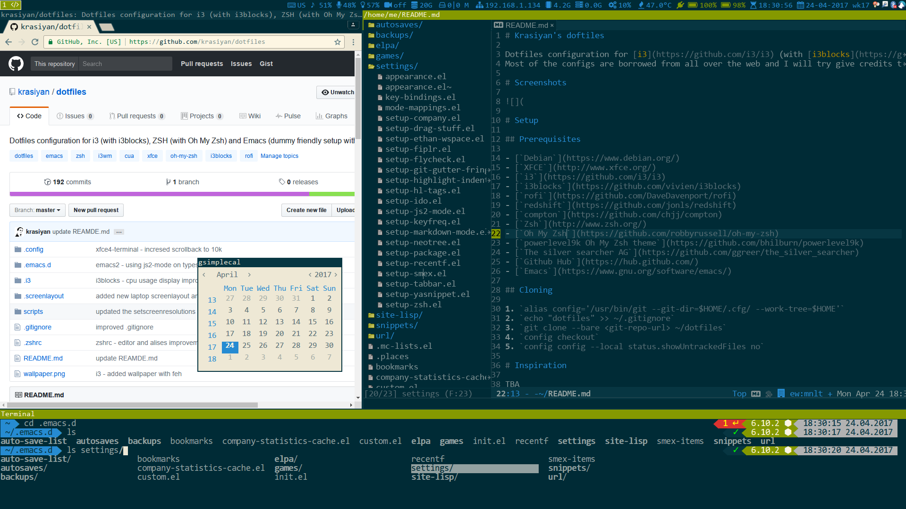
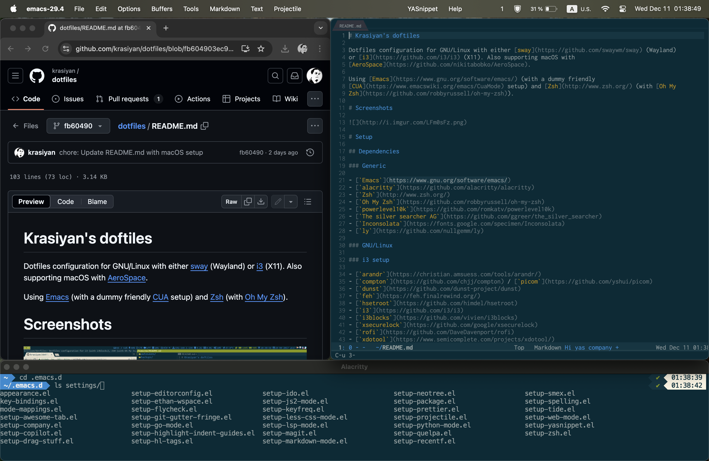

# Krasiyan's doftiles

Dotfiles configuration for GNU/Linux with either [sway](https://github.com/swaywm/sway) (Wayland)
or [i3](https://github.com/i3/i3) (X11). Also supporting macOS with
[AeroSpace](https://github.com/nikitabobko/AeroSpace).

Using [Emacs](https://www.gnu.org/software/emacs/) (with a dummy friendly
[CUA](https://www.emacswiki.org/emacs/CuaMode) setup) and [Zsh](http://www.zsh.org/) (with [Oh My
Zsh](https://github.com/robbyrussell/oh-my-zsh)).

# Screenshots

- i3
  

- macOS
  

# Setup

## Dependencies

### Generic

- [`Emacs`](https://www.gnu.org/software/emacs/)
- [`alacritty`](https://github.com/alacritty/alacritty)
- [`Zsh`](http://www.zsh.org/)
- [`Oh My Zsh`](https://github.com/robbyrussell/oh-my-zsh)
- [`powerlevel10k`](https://github.com/romkatv/powerlevel10k)
- [`The silver searcher AG`](https://github.com/ggreer/the_silver_searcher)
- [`Inconsolata`](https://fonts.google.com/specimen/Inconsolata)
- [`ly`](https://github.com/nullgemm/ly)

### GNU/Linux

### i3 setup

- [`arandr`](https://christian.amsuess.com/tools/arandr/)
- [`compton`](https://github.com/chjj/compton) / [`picom`](https://github.com/yshui/picom)
- [`dunst`](https://github.com/dunst-project/dunst)
- [`feh`](https://feh.finalrewind.org/)
- [`hsetroot`](https://github.com/himdel/hsetroot)
- [`i3`](https://github.com/i3/i3)
- [`i3blocks`](https://github.com/vivien/i3blocks)
- [`xsecurelock`](https://github.com/google/xsecurelock)
- [`rofi`](https://github.com/DaveDavenport/rofi)
- [`xdotool`](https://www.semicomplete.com/projects/xdotool/)
- [`xkblayout-state`](https://github.com/nonpop/xkblayout-state)
- [`flameshot`](https://flameshot.org/)
- [`gufw`](https://help.ubuntu.com/community/Gufw)

### sway setup

- [`gammastep`](https://gitlab.com/chinstrap/gammastep)
- [`grimshot`](https://github.com/swaywm/sway/blob/master/contrib/grimshot)
- [`kanshi`](https://github.com/emersion/kanshi)
- [`mako`](https://github.com/emersion/mako)
- [`sway`](https://github.com/i3/sway)
- [`waybar`](https://github.com/Alexays/Waybar)
- [`wofi`](https://github.com/tsujp/wofi)

:information_source: Initial support for `sway` was added @
[!1](https://github.com/krasiyan/dotfiles/pull/1)

### MacOS

- [`homebrew`](https://brew.sh/)
- [`AeroSpace`](https://github.com/nikitabobko/AeroSpace)
- [`Karabiner`](https://github.com/pqrs-org/Karabiner-Elements)
- [`LuLu`](https://objective-see.org/products/lulu.html)

:information_source: Initial support for `MacOS` was added @
[!2](https://github.com/krasiyan/dotfiles/pull/2)

## Cloning

1. `alias dotfiles='/usr/bin/git --git-dir=$HOME/dotfiles/ --work-tree=$HOME'`
3. `git clone --bare https://github.com/krasiyan/dotfiles.git ~/dotfiles`
4. `dotfiles checkout`
5. `dotfiles config --local status.showUntrackedFiles no`

## MacOS setup snippets

- Dump initial macOS defaults and diff them later:

  ```sh

  defaults read > defaults.pre

  # apply custom defaults; make manual settings changes

  defaults read > defaults.post

  git diff --no-index defaults.pre defaults.post
  ```

- Apply custom [macOS defaults](https://macos-defaults.com/):

  ```sh
  . ~/scripts/macos_defaults.sh
  ```

- Update `Brewfile`:

  ```sh
  cd ~ && brew bundle dump --force
  ```
